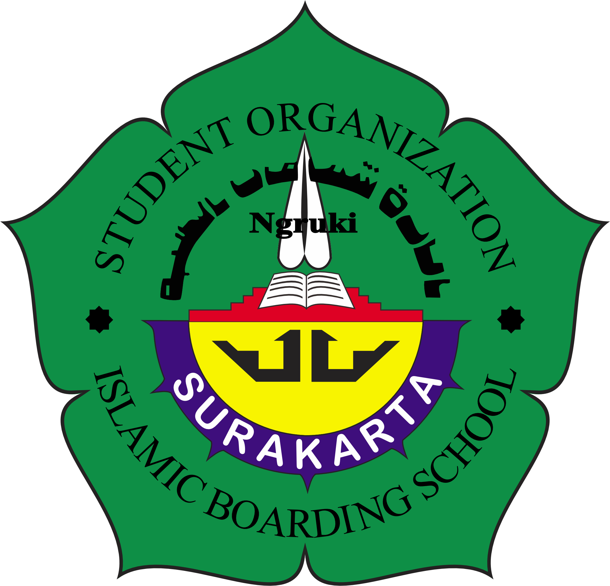

#  Website Imaarotu Syu’unith Tholabah (IST)

Project Website resmi Imaarotu Syu’unith Tholabah

Tujuan dari website ini adalah untuk mempermudah penyampaian informasi seputar IST, seperti struktur organisasi, bagian-bagian, kegiatan, dan arsip periode sebelumnya, agar lebih mudah diakses oleh santri, alumni, dan pihak lainnya.

---

##  Fitur Utama

-  Struktur organisasi berdasarkan periode
-  Profil dan deskripsi tiap divisi (menyusul)
-  Informasi kegiatan dan program kerja (otw)
-  Tampilan responsif (mobile-friendly)
-  Desain bersih dan mudah dibaca

---

##  Teknologi yang Digunakan

- HTML5
- CSS3
- JavaScript (Vanilla)

---

##  Tampilan Website

> Logo IST:
>
> 
>

---

##  Cara Menjalankan Secara Lokal

1. buka tautan ini
   https://atsauban.github.io/IST-website

